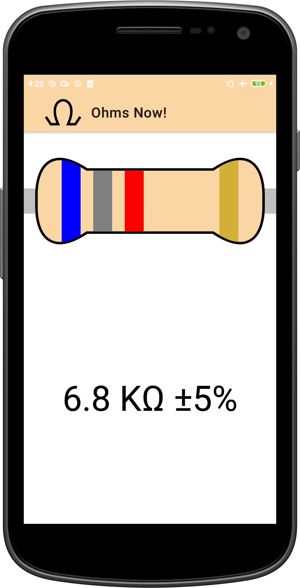
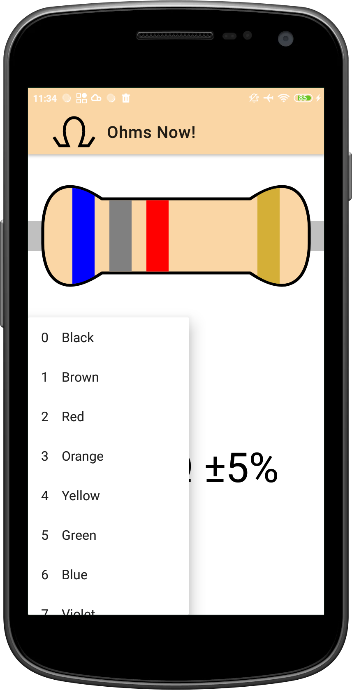
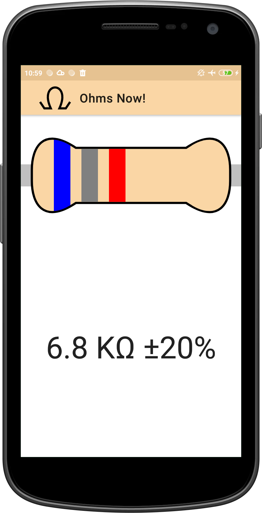
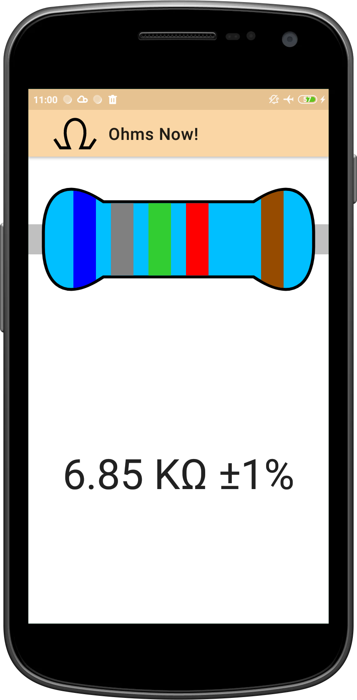

# Ohms Now!

## About
Ohms Now! is a simple app that helps you decode resistor colour bands.

Simply tap on each band to change its colour.
Once you have set all the bands to match your resistor's colours, you can then read its value in the text field below.

By long pressing on a band, there will be a popup menu for you to choose the band's colour.

You can swipe left/right to go to the previous/next E series value.

## Download

## License

    Copyright (c) 2021 Toh Jeen Gie Keith

    Ohms Now! is free software: you can redistribute it and/or modify
    it under the terms of the GNU General Public License as published by
    the Free Software Foundation, either version 3 of the License, or
    (at your option) any later version.

    Ohms Now! is distributed in the hope that it will be useful,
    but WITHOUT ANY WARRANTY; without even the implied warranty of
    MERCHANTABILITY or FITNESS FOR A PARTICULAR PURPOSE.  See the
    GNU General Public License for more details.

    You should have received a copy of the GNU General Public License
    along with Ohms Now!.  If not, see <https://www.gnu.org/licenses/>.
